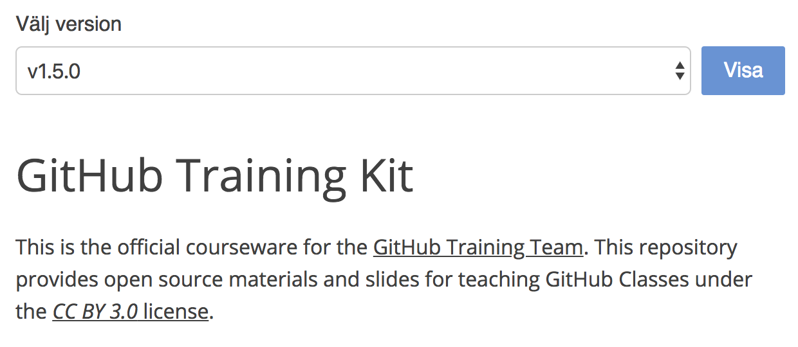

# Github-versionerad fil

SiteVision WebApp som visar innehållet i en fil från ett git-arkiv med ett formulär för att visa olika versioner (taggar).

## Installation

> **OBS!** I dagsläget finns ingen signerad version av webappen vilket behövs för att den ska kunna importeras.

1. Gå in på [releases][releases] och ladda ner certifikatet samt webapp-filen.
2. Installera tilläggscertifikatet enligt [SiteVision:s hjälpsida om tilläggscertifikat][sitevision-help-addon-certificate].
3. Gå in under fliken *Tillägg* och installera webappen enligt [SiteVision:s hjälpsida om Tillägg][sitevision-help-addons].

[releases]: https://github.com/hampusn/github-versioned-file/releases
[sitevision-help-addon-certificate]: https://help.sitevision.se/SiteVision_4_0/12706341.html
[sitevision-help-addons]: https://help.sitevision.se/SiteVision_4_0/12705868.html
